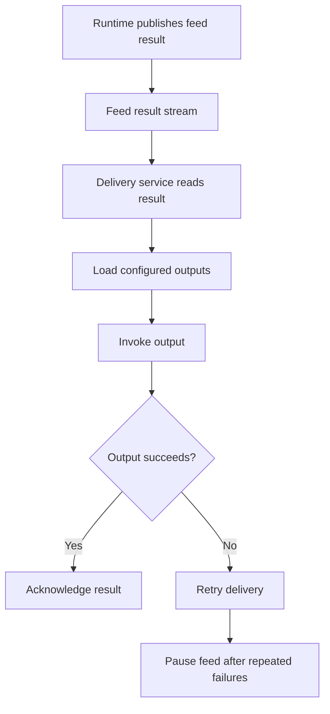

# Delivery

The Delivery service picks up feed results and invokes the feed's configured outputs.

## Delivery Flow

## Webhooks

Webhook delivery is the supported output type available today. Each webhook output includes a URL, HTTP method, headers, and timeout settings. Headers can be used to pass authentication or other verification values your endpoint requires.

## Retries

The Delivery service retries failed webhook sends. If delivery keeps failing, it can request that the feed be paused.

## Decoupling

Delivery is decoupled from feed execution. This lets the Runtime publish matched results while the Delivery service invokes the configured outputs separately.
