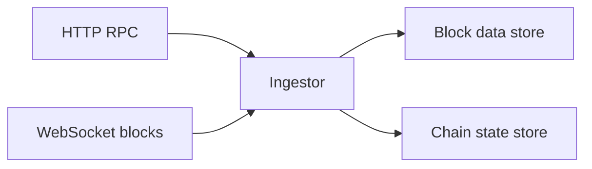

# Ingestion

The Ingestor connects to configured blockchain networks, reads block data, and writes normalized payloads into Atria's block store. EVM networks are supported today, with additional chain families on the roadmap.

## What It Reads

- Blocks with transactions.
- Blocks with logs.
- Debug traces.

## Network Flow

## Realtime and Fallback

The Ingestor can listen for new blocks over WebSocket and uses polling fallback so feeds can continue processing when a WebSocket signal is delayed or unavailable.

For chain reorganizations, see [reorg handling](/atria/architecture/reorg-handling).
