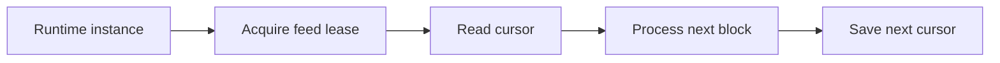

# Leases and Cursors

Atria uses leases to decide which service instance owns work, and cursors to track feed progress. A lease is a temporary ownership claim. It is not a user-facing feed setting. It is an internal coordination mechanism that helps Atria avoid duplicate processing.

## Runtime Lease

A runtime lease marks which runtime instance owns a feed. This prevents multiple runtime instances from processing the same feed at the same time.

## Delivery Lease

A delivery lease coordinates delivery workers so feed outputs are not delivered by multiple workers at once.

## Cursor

The cursor stores the next block number a feed should process.

See [cursors and block delay](/atria/core-concepts/cursors-and-block-delay).
