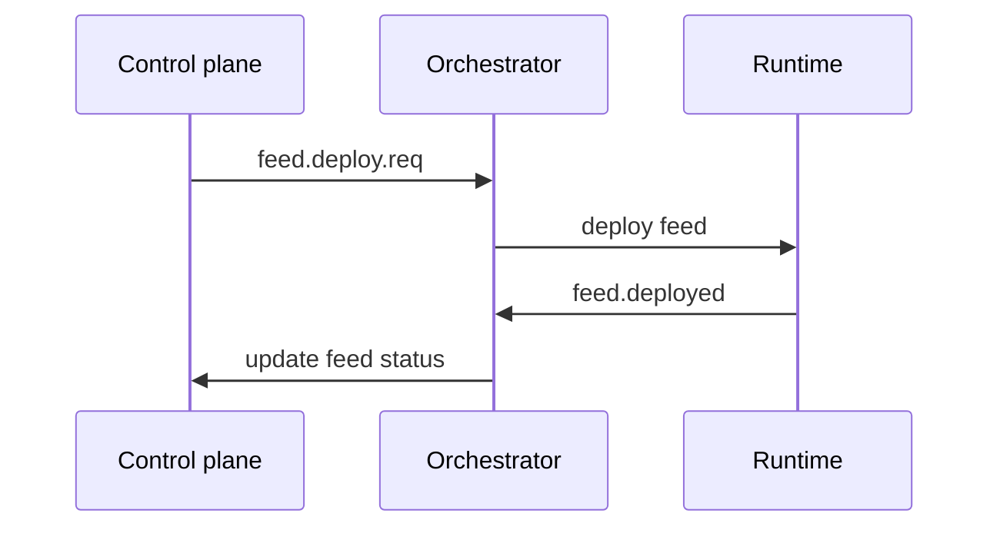

# Orchestrator

The Orchestrator coordinates feed deployment, status transitions, delivery configuration requests, and runtime health.

## Responsibilities

- Handles feed deploy requests.
- Tracks `Pending`, `Running`, `Paused`, `Error`, and `Completed` transitions.
- Confirms runtime deployment events.
- Responds to delivery services with output configuration.
- Provisions feeds and outputs from manifests.

## Control Flow

