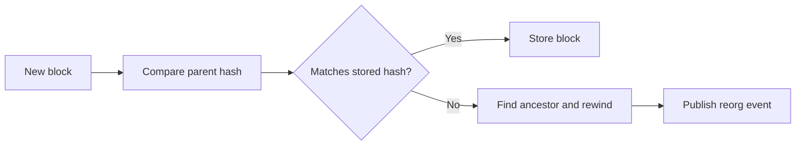

# Reorg Handling

Blockchain reorganizations can replace previously observed blocks. Atria tracks block hashes and parent hashes so the Ingestor can detect when the local chain view diverges from the network.

## Detection

For each new block, the Ingestor compares the block parent hash with the stored hash of the previous block. A mismatch indicates a possible reorg.

## Response

When a reorg is detected, Atria searches back to a common ancestor, rewinds stored state, and publishes a reorg event.

## Feed Impact

Feeds receive metadata that includes `isReorg`. Feed authors can use this field when they need reorg-aware behavior.

For payload shapes, see [data types](/atria/core-concepts/data-types).
