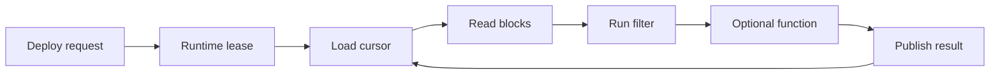

# Runtime

The Runtime executes deployed feeds. It claims feed leases, reads block data, runs filters, optionally runs functions, and publishes feed results. A lease is a temporary ownership claim for a feed, used to keep execution coordinated when more than one runtime instance exists.

## Runtime Flow

## Filter Execution

Filters run in a V8 JavaScript environment. They are compiled once per feed deployment and executed for each payload.

Bundled modules include:

- `ethers`
- `@atria/sdk`
- `@atria/kv`

For more details, see [filters](/atria/core-concepts/filters).

## Function Execution

If a feed includes a function, the Runtime runs it after the filter emits a result. The function receives the filter result and can perform post-filter work such as external lookups, managed database reads, heavier business logic, or action-specific preparation. In the current runtime, functions run in a Fission-based serverless environment.

If the filter returns `null` or `undefined`, the feed does not emit and the function is not called. If the feed has no function, the filter result becomes the feed result.

For more details, see [functions](/atria/core-concepts/functions).

## Cursors

The Runtime stores a cursor per feed. When a feed restarts, it resumes from the last stored block unless a new start block is configured.

For coordination details, see [leases and cursors](/atria/architecture/leases-and-cursors).

## Limits

Execution time, heap size, stack usage, and output size are bounded by runtime settings. See [security and sandboxing](/atria/architecture/security-and-sandboxing).
