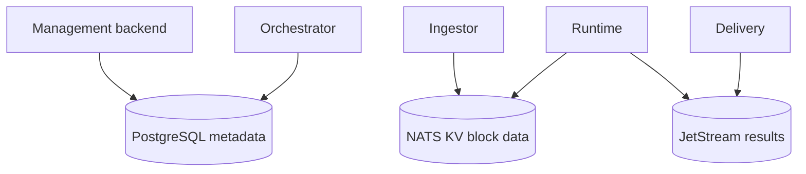

# Storage and Messaging

Atria uses PostgreSQL for product metadata and NATS for event streams, block storage, leases, cursors, and chain state.

## PostgreSQL

PostgreSQL stores:

- Feeds.
- Outputs.
- Tags.
- Feed-output links.
- Deploy records.
- Status history.

## NATS JetStream and KV

NATS is used for:

- Feed deploy requests.
- Feed deployed events.
- Pause events.
- Feed result streams.
- Block data buckets.
- Chain state.
- Runtime and delivery leases.
- Feed cursors.

## High-Level Map

For feed result delivery, see [delivery](/atria/architecture/delivery).
