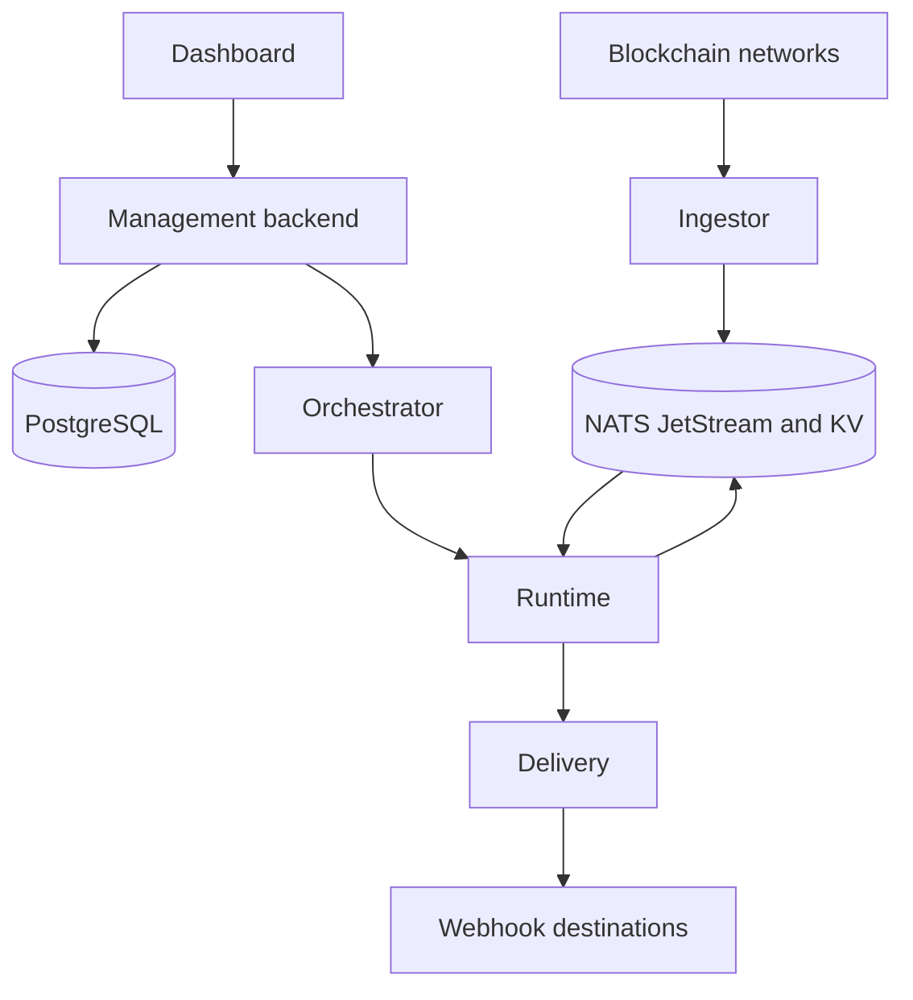

# System Overview

Atria is composed of focused services that separate control, ingestion, execution, and delivery.

## Services

- **Dashboard**: Web UI for creating and monitoring feeds.
- **Management backend**: Coordinates feed metadata, outputs, tags, configuration, deploys, and results for the Dashboard and automation.
- **Orchestrator**: Deployment coordination, lease checks, status updates, and local provisioning.
- **Ingestor**: Blockchain connectivity and block data ingestion.
- **Runtime**: Feed execution, cursor management, filters, and optional functions.
- **Delivery**: Result consumption and webhook delivery.

## Infrastructure

Atria uses PostgreSQL for core metadata and NATS JetStream/KV for messaging, leases, cursors, chain state, and block data.

See [storage and messaging](/atria/architecture/storage-and-messaging).

For runtime ownership and progress tracking, see [leases and cursors](/atria/architecture/leases-and-cursors).
