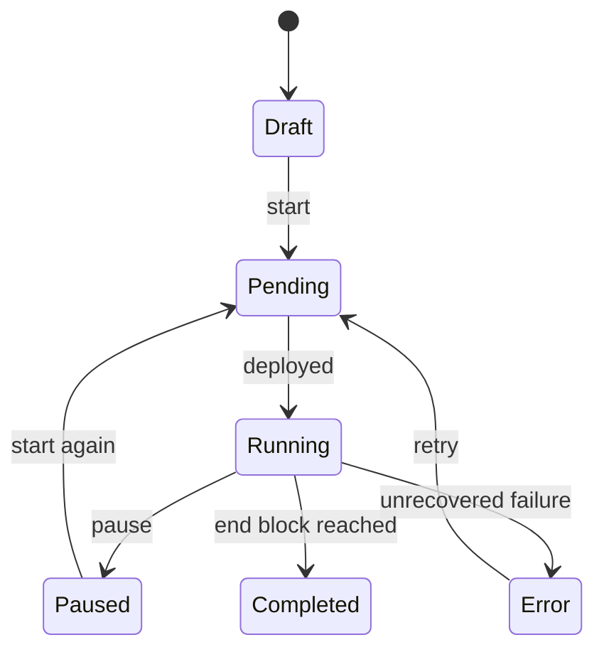

# Feed Lifecycle

A feed moves through a small set of statuses as it is created, deployed, run, paused, or completed.

## Statuses

- `Draft`: The feed exists but is not running.
- `Pending`: A deployment request has been created.
- `Running`: A runtime instance has claimed the feed and is processing blocks.
- `Paused`: Processing was stopped by a user or by the system.
- `Error`: The system paused the feed because deployment or processing failed.
- `Completed`: The feed reached its configured end block.

## Lifecycle Flow

## Operational Details

The [Orchestrator](/atria/architecture/orchestrator) tracks deployment state. The [Runtime](/atria/architecture/runtime) owns active execution through a lease, which is a temporary claim that prevents two runtime instances from processing the same feed at the same time. The runtime also stores the cursor and resumes from the last processed block.

For more detail, see [leases and cursors](/atria/architecture/leases-and-cursors).
