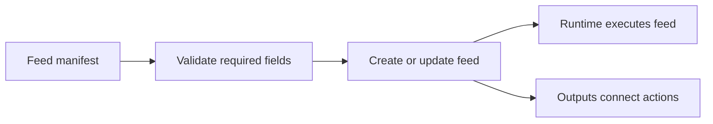

# Feed Manifest

A feed manifest is the declarative definition behind every feed. It captures the feed's identity, source data, runtime code, and connected outputs in a form Atria can provision and operate.

## How Atria Uses It

The Orchestrator uses the manifest definition to validate the required fields and turn the feed definition into an executable feed record.



The manifest is not runtime state. It does not store the current cursor, feed status, recent results, delivery attempts, or deployment history. Those are managed by Atria after the feed exists.

## Example

```json
{
  "name": "Large Native Transfers",
  "version": "1.0.0",
  "description": "Emits when native transfers match the configured criteria.",
  "author": "Your Team",
  "config": {
    "source": {
      "networkId": "ethereum-mainnet",
      "dataType": "BlockWithTransactions",
      "startBlock": null,
      "endBlock": null
    },
    "runtime": {
      "errorHandling": "ContinueOnError",
      "filter": {
        "path": "filter.js"
      }
    },
    "destination": {
      "outputs": ["operations-webhook"],
      "errorHandling": "ContinueOnError"
    }
  }
}
```

## Main Fields

- `name`: Human-readable feed name.
- `version`: Feed definition version.
- `description`: Short explanation of what the feed detects or enables.
- `author`: Optional owner or team label.
- `config.source.networkId`: Network identifier, such as `ethereum-mainnet`.
- `config.source.dataType`: Payload type passed to the filter. See [data types](/atria/core-concepts/data-types).
- `config.source.startBlock`: Optional first block to process.
- `config.source.endBlock`: Optional last block to process.
- `config.runtime.filter.path`: Path to the filter code used by the feed.
- `config.runtime.function.path`: Optional path to post-filter function code when a function is used.
- `config.runtime.errorHandling`: Runtime error strategy for feed execution.
- `config.destination.outputs`: Optional list of output names to connect to the feed.
- `config.destination.errorHandling`: Delivery-side error strategy.

## What Gets Provisioned

When Atria creates or updates a feed from a manifest, the feed receives the manifest's name, version, description, network, data type, start and end block, filter path, optional function path, and connected outputs.

Outputs are resolved by name. For example, if `config.destination.outputs` contains `operations-webhook`, Atria looks for an output with that name and connects it to the feed.

## Manifest and Code Files

The manifest points to code, but it does not contain the code itself. The filter path tells Atria which file to load for the feed's [filter](/atria/core-concepts/filters). If the feed uses a [function](/atria/core-concepts/functions), the function path points to that code as well.

For practical examples of feed manifests, see the [Atria Library](/atria/library/overview).
