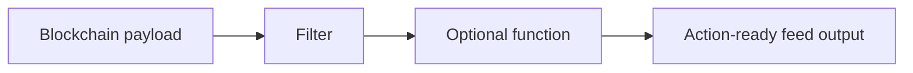

# Functions

A function is optional logic that runs after a filter. It receives the filter result and prepares the feed output for the action, integration, or system that comes next.

## When to Use a Function

Use a function when you need to:

- Keep the filter focused on event matching and first-pass shaping.
- Add a separate post-filter step for heavier business logic.
- Call an external API or managed database after an event has already matched.
- Prepare action-specific context without hiding the trigger condition.
- Isolate integration-specific work from the core feed logic.

A good mental model is: the filter answers "does this payload matter, and what should the feed emit first?" A function answers "after the feed has emitted, what extra work is needed before the next action can use it?" That extra work may involve service lookups, database reads, action-specific preparation, or logic that should run outside the filter's tight execution path.

## Flow

## Runtime Note

Function execution is an optional deployment capability. In the current runtime, functions use the Fission-based serverless path for post-filter execution.

If a feed has no function, the filter result becomes the feed output.

## Design Guidance

Do not use a function just because the output needs a different field name or a smaller object. Filters can already shape the emitted result.

Use a function when the work is meaningfully separate from matching the blockchain payload. Team members should be able to read the filter and understand why a feed emits. The function can then handle post-filter responsibilities such as enrichment from another service, lookup-driven decisions, action preparation, or integration logic.
