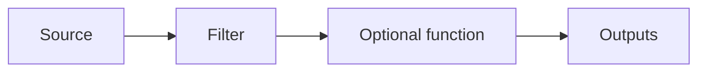

# What Is a Feed

A feed is Atria's core primitive for building event-driven workflows. It listens to a specific type of blockchain data, decides what matters, and emits a structured payload when the feed logic matches.

## Anatomy

- **Source**: Network, data type, and optional block range.
- **Filter**: Feed logic that decides whether to emit and can shape the payload it returns. In the current runtime, filters are authored in JavaScript.
- **Function**: Optional post-filter logic for heavier enrichment, integration-specific formatting, or complex transformation.
- **Outputs**: Connectors that use the emitted payload to trigger the next action.
- **Cursor**: Stored progress that tells the runtime which block to process next.
- **Metadata**: Name, version, tags, description, status, and deployment history.

## Feed Input

Feed input comes from one [data type](/atria/core-concepts/data-types), such as `BlockWithTransactions` or `BlockWithLogs`.

## Feed Output

If the feed returns `null` or `undefined`, Atria emits no result. If it returns an object, Atria wraps it as feed output data and sends it to configured outputs.

## Related Pages

- [Feed lifecycle](/atria/core-concepts/feed-lifecycle)
- [Cursors and block delay](/atria/core-concepts/cursors-and-block-delay)
- [Filters](/atria/core-concepts/filters)
- [Results](/atria/core-concepts/results)
- [Outputs](/atria/core-concepts/outputs)
- [Feed manifest](/atria/core-concepts/feed-manifest)
