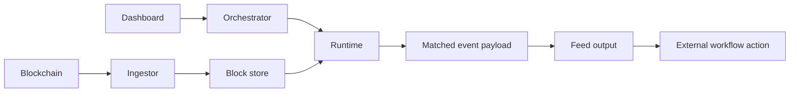

# How Atria Works

Atria separates blockchain ingestion, feed execution, lifecycle management, and delivery into focused services. This keeps feed logic small while the platform handles the operational work around it.

## End-to-End Flow

## Steps

1. The [Ingestor](/atria/architecture/ingestion) reads blocks, logs, and traces from configured networks.
2. The [Runtime](/atria/architecture/runtime) picks up data for each running feed.
3. The feed [filter](/atria/core-concepts/filters) decides whether to emit and can shape the payload it returns.
4. An optional [function](/atria/core-concepts/functions) adds a post-filter step for heavier enrichment, integration-specific formatting, or keeping complex transformation logic out of the filter.
5. The feed output triggers the next action in an external workflow.
6. The Dashboard, management backend, and [Orchestrator](/atria/architecture/orchestrator) manage creation, deployment, pausing, and health.

## Why This Matters

Teams write the event logic that matters to them. Atria handles chain connectivity, block storage, execution isolation, cursors, retries, delivery, and operational state.
