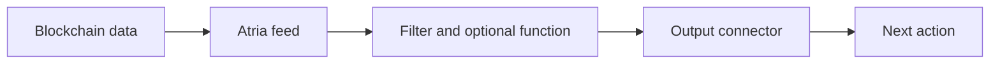

# Atria

Atria is Pulsy's off-chain backend for event-driven blockchain workflows. It turns on-chain events into real-time actions by running feeds that read blockchain data, apply custom logic, and deliver structured outputs.

Use Atria when your team needs to monitor wallets, contracts, protocols, treasuries, bridge flows, DEX activity, lending risk, stablecoin movements, or other on-chain signals without building the full ingestion and runtime layer yourself.

## What Atria Does

- Reads blockchain data from configured networks.
- Runs feed logic.
- Emits structured results only when your conditions match.
- Delivers matching results to outputs.
- Supports cloud, self-managed, private, and on-prem deployment models.

## The Core Idea

Atria is built around a [feed](/atria/core-concepts/what-is-a-feed). A feed is the primitive you use to build workflows: it selects a data source, runs event logic, optionally reshapes the payload, and triggers the next action through an output.

## Where to Go Next

- Learn [how Atria works](/atria/getting-started/how-atria-works).
- Review common [use cases](/atria/getting-started/key-use-cases).
- Understand [feeds](/atria/core-concepts/what-is-a-feed).
- Explore the [Atria Library](/atria/library/overview).
