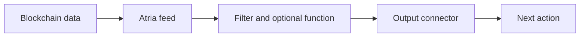

  <iframe
    src="https://www.youtube.com/embed/M8p-grH4kOI?si=vG0YNRAcn_lwzJOl"
    title="YouTube video player"
    frameBorder="0"
    allow="accelerometer; autoplay; clipboard-write; encrypted-media; gyroscope; picture-in-picture; web-share"
    referrerPolicy="strict-origin-when-cross-origin"
    allowFullScreen
    style={{ position: "absolute", inset: 0, width: "100%", height: "100%" }}
  ></iframe>

# Atria

Atria is Pulsy's off-chain backend for event-driven blockchain workflows. It turns on-chain events into real-time actions by running feeds that read blockchain data, apply custom logic, and deliver structured outputs.

<Columns cols={2}>
  <Card
    title="Try Atria Cloud"
    href="https://atria.pulsy.app"
  >
    Build feeds in the hosted dashboard. Pulsy runs the infrastructure.
  </Card>
  <Card
    title="Self-Host from GitHub"
    href="https://github.com/Pulsy-Global/atria"
  >
    Run Atria in your own infrastructure. Full source available.
  </Card>
</Columns>

## Quick Start

<Columns cols={2}>
  <Card
    title="Create, Test, and Deploy a Feed"
    href="/atria/dashboard/create-test-and-deploy-a-feed"
  >
    Build a feed with AI or manually, test it against chain data, and start it.
  </Card>
  <Card
    title="Create an Output"
    href="/atria/dashboard/create-an-output"
  >
    Set up a reusable connector with AI or manual configuration.
  </Card>
</Columns>

Use Atria when your team needs to monitor wallets, contracts, protocols, treasuries, bridge flows, DEX activity, lending risk, stablecoin movements, or other on-chain events without building the full ingestion and runtime layer yourself.

## What Atria Does

- Reads blockchain data from configured networks.
- Runs feed logic.
- Emits structured results only when your conditions match.
- Delivers matching results to outputs.
- Supports cloud, self-managed, private, and on-prem deployment models.

## The Core Idea

Atria is built around a [feed](/atria/core-concepts/what-is-a-feed). A feed is the primitive you use to build workflows: it selects a data source, runs event logic, optionally reshapes the payload, and triggers the next action through an output.

## Where to Go Next

- Learn [how Atria works](/atria/getting-started/how-atria-works).
- Review common [use cases](/atria/getting-started/key-use-cases).
- Understand [feeds](/atria/core-concepts/what-is-a-feed).
- Explore the [Atria Library](/atria/library/overview).
