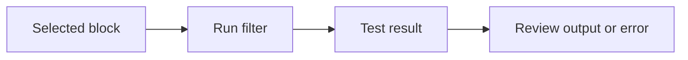

# Testing Feeds

Atria supports testing feed logic against block data before a feed goes live. This helps teams validate filters, output shape, and edge cases before deployment.

Testing matters because feeds often become operational contracts. Once a destination starts relying on a payload shape, even a small field change can break an alert, pipeline, or internal service.

## What to Test

- The selected [data type](/atria/core-concepts/data-types).
- Whether `main(stream)` returns `null` when it should.
- Whether matching output is JSON-safe.
- Address casing and token unit handling.
- Error behavior for empty logs, missing fields, or malformed events.

## Test Flow

## Testing Surface

In the Dashboard, you can test a feed against a selected block and review the returned result or error before starting the feed.

When testing feeds, use blocks that are known to contain the event type you care about. For example, test an ERC-20 transfer feed against a block with matching token transfer logs, not just a random recent block.
