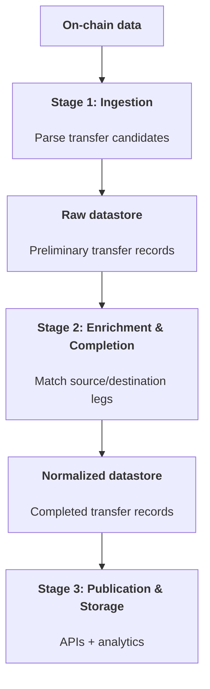

## What XFlow is Tracking

XFlow tracks cross-chain transfers by observing activity on multiple blockchains and bridge protocols, then correlating the inbound and outbound legs into a single, normalized transfer record. The goal is to provide a consistent, chain-agnostic view of a cross-chain transfer, including:

- Source and destination chains.
- Source and destination transaction hashes.
- Sender and recipient addresses.
- Tokens and amounts (including USD valuation where available).
- Detection and completion timestamps.
- Protocol attribution.

## High-Level Architecture

XFlow’s pipeline is composed of three stages that run continuously:

1. Ingestion (on-chain data parsers).
2. Enrichment and completion (matching the two sides).
3. Publication and storage (normalized records for APIs and analytics).

Each stage is designed to be resilient to partial data, variable settlement times, and differences across chains and protocols.

## Stage 1: Ingestion

XFlow uses a set of protocol-specific parsers (“engines”). Each engine knows how to identify candidate transfers for a given bridge. Engines ingest data from a mix of on-chain sources, which can include:

- Transactions.
- Logs.
- Internal transaction traces.
- Debug data.

The ingestion phase produces a preliminary transfer object with whatever data is immediately available. This object is stored as an internal record in a raw datastore, along with associated metadata extracted from the blockchain.

## Stage 2: Enrichment and Completion

Cross-chain transfers rarely arrive as a fully complete record in a single pass. XFlow therefore runs a continuous completion service that attempts to fill in missing details for both sides of a transfer.

XFlow prioritizes fully deterministic matching of transfer legs. In rare cases where on-chain data alone is not sufficient, non-deterministic matching can be used, relying on expected timestamps and acceptable amount ranges.

The completion process operates as follows:

- It loads pending cross-chain transfers that are partially complete.
- It searches for related transactions using protocol-specific search terms.
- It applies engine-specific logic to map candidate transactions onto the correct “from” and “to” sides.
- It normalizes chain, network, token, and address data to a consistent schema.
- It marks the transfer as completed once both sides meet the completeness criteria.

XFlow supports cases where the destination transaction appears before the source transaction, and continues revisiting incomplete transfers until an expiration window is reached.

## Stage 3: Publication and Storage

Once a transfer is complete, XFlow persists a normalized record to its datastore for API consumers and analytics. Raw metadata remains available internally for auditability and further enrichment.

## Data Model Summary

At a high level, XFlow maintains two layers of data:

- Raw blocks and metadata: protocol-specific and generic, used for matching and audit.
- Normalized transfers: completed, de-duplicated, and ready for external consumption.

Each normalized transfer includes:

- Source/destination chains and networks.
- Source/destination transaction hashes.
- Source/destination addresses.
- Tokens and amounts (with decimals normalization).
- Protocol attribution.
- Detection and completion timestamps.
